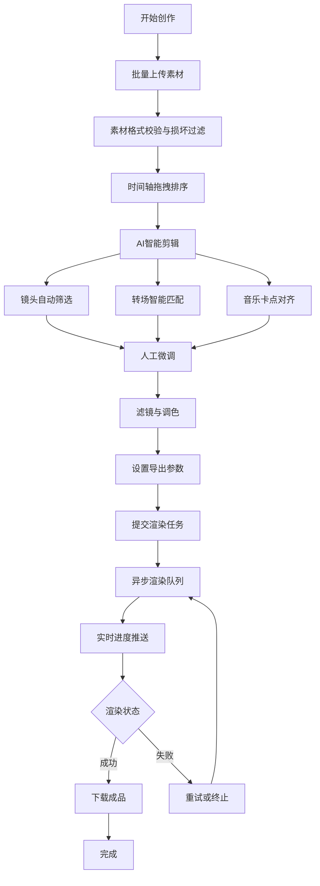

## 1. 产品概述

短视频AI剪辑工具是一款面向新媒体创作者的智能视频剪辑平台，通过AI算法自动完成镜头筛选、转场匹配、背景音乐卡点对齐等专业操作，大幅降低视频制作门槛，提升创作效率。

- **核心价值**：将专业视频剪辑能力AI化，让普通用户也能快速制作高质量短视频
- **目标用户**：新媒体运营、自媒体创作者、短视频达人、营销内容制作者
- **解决痛点**：剪辑耗时久、转场不自然、音乐卡点难、批量处理效率低

## 2. 核心功能

### 2.1 用户角色

| 角色 | 注册方式 | 核心权限 |
|------|----------|----------|
| 创作者 | 本地使用，无需注册 | 素材上传、AI剪辑、渲染导出、任务管理 |

### 2.2 功能模块

1. **工作台首页**：素材库概览、渲染队列状态、快速创建项目
2. **素材管理**：多格式视频/图片批量上传、分片上传、素材预览、损坏过滤
3. **时间轴编辑器**：素材拖拽排序、时长裁剪、转场效果、滤镜调色
4. **AI智能剪辑**：镜头筛选、转场匹配、音乐卡点、掐头去尾、批量调色
5. **渲染队列**：异步渲染、实时进度、暂停/重试/终止、多任务管理
6. **导出设置**：分辨率自定义、帧率选择、格式兼容、输出预览

### 2.3 页面详情

| 页面名称 | 模块名称 | 功能描述 |
|---------|----------|----------|
| 工作台 | 顶部导航 | 项目切换、用户信息、全局设置 |
| 工作台 | 素材库面板 | 素材网格展示、上传按钮、筛选搜索、批量选择 |
| 工作台 | 时间轴面板 | 多轨道时间轴、素材拖拽排序、缩放控制、播放头 |
| 工作台 | 属性面板 | 素材属性编辑、滤镜选择、调色参数、转场设置 |
| 工作台 | AI功能区 | 一键智能剪辑、镜头筛选、音乐卡点、批量调色 |
| 工作台 | 渲染队列 | 任务列表、进度条、状态标识、操作按钮 |
| 导出弹窗 | 导出设置 | 分辨率选择、帧率设置、输出格式、质量参数 |
| 导出弹窗 | 进度预览 | 渲染进度、预估时间、取消/暂停操作 |

## 3. 核心流程

### 3.1 主流程描述

用户上传多段视频/图片素材 → 在时间轴上拖拽排序和裁剪 → 选择AI智能剪辑功能（自动筛选镜头、匹配转场、卡点音乐） → 调整滤镜和调色参数 → 设置导出参数（分辨率、帧率、格式） → 提交渲染任务 → 实时查看渲染进度 → 下载成品视频

### 3.2 流程图

## 4. 用户界面设计

### 4.1 设计风格

- **主色调**：深紫色系（#6366F1 主色）+ 深色背景（#0F0F1A），科技感与专业感兼具
- **辅助色**：青蓝色（#22D3EE）用于高亮和进度指示，琥珀色（#F59E0B）用于警告状态
- **按钮风格**：圆角矩形（8px），渐变填充，hover时轻微放大并增加发光效果
- **字体**：现代无衬线字体，标题使用粗体，正文使用中等字重，数字使用等宽字体
- **布局风格**：三栏式工作台布局（左素材库 + 中预览/时间轴 + 右属性面板），深色主题
- **图标风格**：线性图标（lucide），统一2px描边，激活状态填充主色

### 4.2 页面设计概述

| 页面名称 | 模块名称 | UI元素 |
|---------|----------|--------|
| 工作台 | 整体布局 | 深色背景、三栏布局、可拖拽分隔线、玻璃拟态面板 |
| 工作台 | 素材库 | 卡片式网格、悬浮操作按钮、上传进度条、选中态高亮 |
| 工作台 | 时间轴 | 轨道分层、彩色素材块、时间刻度、拖拽手柄、缩放滑块 |
| 工作台 | 预览窗口 | 居中播放画面、播放控制条、时间显示、全屏按钮 |
| 工作台 | 属性面板 | 分组折叠面板、滑块控件、色板选择、预设胶囊按钮 |
| 工作台 | 渲染队列 | 列表式布局、进度条动画、状态徽章、操作按钮组 |
| 导出弹窗 | 表单区域 | 分段控制器、数字输入框、下拉选择、滑动条 |
| 导出弹窗 | 进度区域 | 大尺寸环形进度、百分比数字、状态文字、操作按钮 |

### 4.3 响应式设计

- **桌面端优先**：以1440px宽度为基准设计，三栏完整布局
- **平板适配**：1024px以下折叠右侧属性面板，改为抽屉式呼出
- **触控优化**：拖拽区域最小48px触控目标，关键操作按钮放大

### 4.4 动效与交互

- **页面加载**：元素错落淡入，进度条骨架屏占位
- **素材拖拽**：半透明幽灵预览，放置位置指示线，吸附对齐反馈
- **渲染进度**：进度条平滑动画，状态切换过渡，百分比数字滚动
- **按钮交互**：hover缩放1.03倍，active缩放0.97倍，焦点发光环
- **面板切换**：滑入滑出过渡，内容淡入淡出
