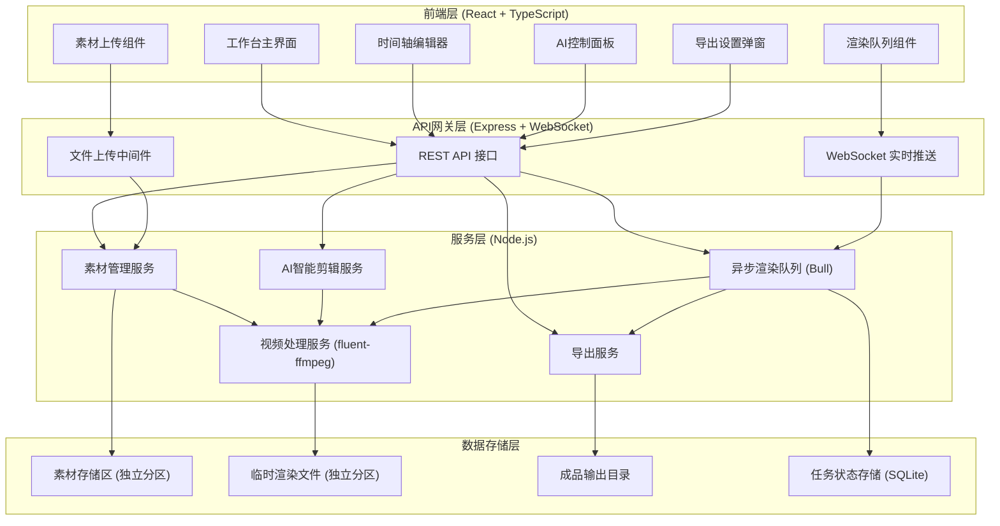
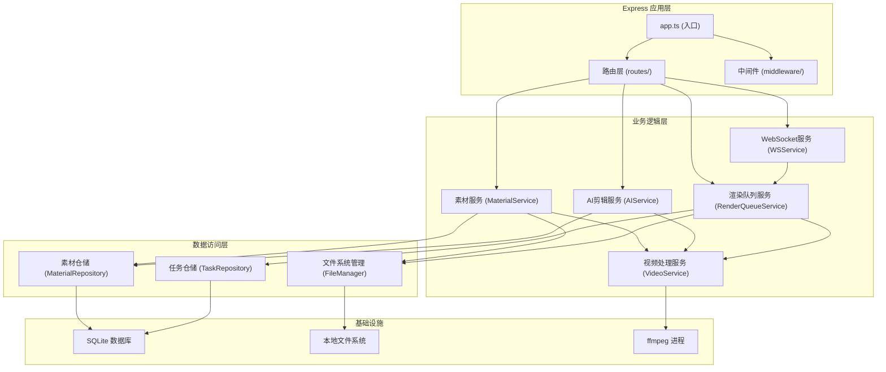
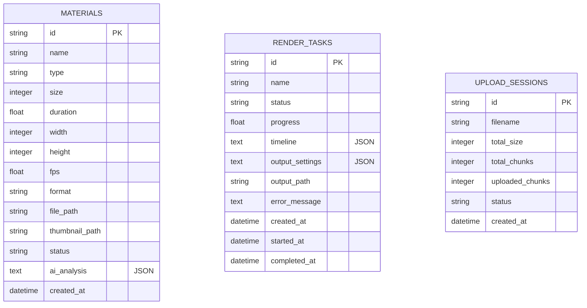

## 1. 架构设计



## 2. 技术描述

- **前端**：React 18 + TypeScript + Vite + TailwindCSS 3 + Zustand + lucide-react
- **后端**：Express 4 + TypeScript + ESM
- **实时通信**：WebSocket (ws 库)
- **视频处理**：fluent-ffmpeg + ffprobe
- **异步任务**：Bull (Redis队列)，本地开发用内存队列模拟
- **文件上传**：multer + 分片上传 (自定义实现)
- **数据存储**：SQLite (better-sqlite3)
- **端口配置**：后端服务运行在 8674 端口

## 3. 路由定义

### 前端路由

| 路由 | 页面 | 说明 |
|------|------|------|
| / | 工作台 | 主编辑界面，包含素材库、时间轴、预览窗口 |
| /render | 渲染队列 | 查看所有渲染任务及进度 |

### 后端 API 路由

| 方法 | 路径 | 说明 |
|------|------|------|
| POST | /api/upload/init | 初始化分片上传 |
| POST | /api/upload/chunk | 上传文件分片 |
| POST | /api/upload/merge | 合并分片完成上传 |
| GET | /api/materials | 获取素材列表 |
| DELETE | /api/materials/:id | 删除素材 |
| GET | /api/materials/:id/metadata | 获取素材元信息 |
| POST | /api/ai/analyze | AI分析素材（镜头检测等） |
| POST | /api/ai/smart-cut | 智能剪辑生成时间轴 |
| POST | /api/ai/music-beat | 音乐卡点分析 |
| POST | /api/render/submit | 提交渲染任务 |
| GET | /api/render/tasks | 获取渲染任务列表 |
| GET | /api/render/tasks/:id | 获取单个任务详情 |
| POST | /api/render/tasks/:id/pause | 暂停任务 |
| POST | /api/render/tasks/:id/resume | 恢复任务 |
| POST | /api/render/tasks/:id/retry | 重试任务 |
| POST | /api/render/tasks/:id/cancel | 取消任务 |
| GET | /api/render/tasks/:id/download | 下载成品 |
| GET | /ws | WebSocket连接（实时进度推送） |

## 4. API 定义

### 4.1 类型定义

```typescript
// 素材类型
interface Material {
  id: string;
  name: string;
  type: 'video' | 'image' | 'audio';
  size: number;
  duration?: number;
  width?: number;
  height?: number;
  fps?: number;
  format: string;
  thumbnailPath?: string;
  filePath: string;
  status: 'uploading' | 'ready' | 'error' | 'processing';
  createdAt: number;
  aiAnalysis?: AIAnalysisResult;
}

// AI分析结果
interface AIAnalysisResult {
  shots: Shot[];
  quality: number;
  motionLevel: number;
  brightness: number;
  colorfulness: number;
}

// 镜头片段
interface Shot {
  startTime: number;
  endTime: number;
  duration: number;
  score: number;
  thumbnail: string;
}

// 时间轴片段
interface TimelineClip {
  id: string;
  materialId: string;
  track: number;
  startTime: number;
  endTime: number;
  sourceStartTime: number;
  sourceEndTime: number;
  filters: FilterConfig[];
  transition?: TransitionConfig;
  speed: number;
}

// 滤镜配置
interface FilterConfig {
  type: string;
  params: Record<string, any>;
}

// 转场配置
interface TransitionConfig {
  type: string;
  duration: number;
  params: Record<string, any>;
}

// 渲染任务
interface RenderTask {
  id: string;
  name: string;
  status: 'pending' | 'processing' | 'paused' | 'completed' | 'failed' | 'cancelled';
  progress: number;
  timeline: TimelineClip[];
  outputSettings: OutputSettings;
  createdAt: number;
  startedAt?: number;
  completedAt?: number;
  errorMessage?: string;
  outputPath?: string;
}

// 输出设置
interface OutputSettings {
  width: number;
  height: number;
  fps: number;
  format: 'mp4' | 'mov' | 'webm';
  bitrate: number;
  quality: 'low' | 'medium' | 'high';
}
```

### 4.2 请求/响应示例

**提交渲染任务**
```typescript
// POST /api/render/submit
interface SubmitRenderRequest {
  name: string;
  timeline: TimelineClip[];
  outputSettings: OutputSettings;
}

interface SubmitRenderResponse {
  taskId: string;
  status: string;
  estimatedTime: number;
}
```

**渲染进度推送 (WebSocket)**
```typescript
interface RenderProgressMessage {
  type: 'progress';
  taskId: string;
  progress: number;
  stage: 'analyzing' | 'processing' | 'encoding' | 'finalizing';
  currentFrame: number;
  totalFrames: number;
  speed: string;
}
```

## 5. 服务器架构图



## 6. 数据模型

### 6.1 数据模型ER图



### 6.2 DDL 语句

```sql
-- 素材表
CREATE TABLE materials (
  id TEXT PRIMARY KEY,
  name TEXT NOT NULL,
  type TEXT NOT NULL CHECK (type IN ('video', 'image', 'audio')),
  size INTEGER NOT NULL,
  duration REAL,
  width INTEGER,
  height INTEGER,
  fps REAL,
  format TEXT NOT NULL,
  file_path TEXT NOT NULL,
  thumbnail_path TEXT,
  status TEXT NOT NULL DEFAULT 'processing',
  ai_analysis TEXT,
  created_at INTEGER NOT NULL
);

CREATE INDEX idx_materials_type ON materials(type);
CREATE INDEX idx_materials_status ON materials(status);
CREATE INDEX idx_materials_created_at ON materials(created_at);

-- 渲染任务表
CREATE TABLE render_tasks (
  id TEXT PRIMARY KEY,
  name TEXT NOT NULL,
  status TEXT NOT NULL DEFAULT 'pending' CHECK (status IN ('pending', 'processing', 'paused', 'completed', 'failed', 'cancelled')),
  progress REAL NOT NULL DEFAULT 0,
  timeline TEXT NOT NULL,
  output_settings TEXT NOT NULL,
  output_path TEXT,
  error_message TEXT,
  created_at INTEGER NOT NULL,
  started_at INTEGER,
  completed_at INTEGER
);

CREATE INDEX idx_render_tasks_status ON render_tasks(status);
CREATE INDEX idx_render_tasks_created_at ON render_tasks(created_at);

-- 上传会话表（分片上传）
CREATE TABLE upload_sessions (
  id TEXT PRIMARY KEY,
  filename TEXT NOT NULL,
  total_size INTEGER NOT NULL,
  total_chunks INTEGER NOT NULL,
  uploaded_chunks INTEGER NOT NULL DEFAULT 0,
  status TEXT NOT NULL DEFAULT 'active' CHECK (status IN ('active', 'completed', 'error')),
  created_at INTEGER NOT NULL
);

CREATE INDEX idx_upload_sessions_status ON upload_sessions(status);
```

## 7. 文件存储分区方案

### 7.1 目录结构

```
/storage (独立分区挂载点)
├── source/          # 源文件存储区
│   ├── videos/
│   ├── images/
│   └── audio/
├── temp/            # 临时渲染文件区（独立分区）
│   ├── renders/     # 渲染临时目录
│   ├── chunks/      # 分片上传临时目录
│   └── thumbnails/  # 缩略图缓存
└── output/          # 成品输出目录
    └── completed/
```

### 7.2 配置说明

- 源文件和临时渲染文件建议使用独立磁盘分区，避免相互影响
- 临时渲染目录需定期清理，设置过期自动删除策略
- 大文件优先使用流式处理，减少内存占用
